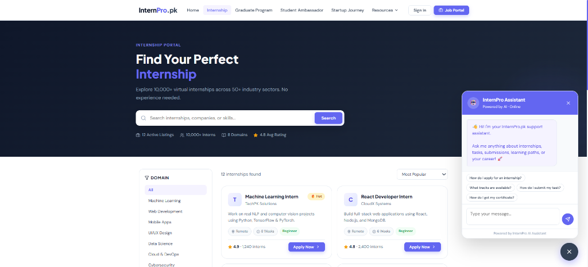
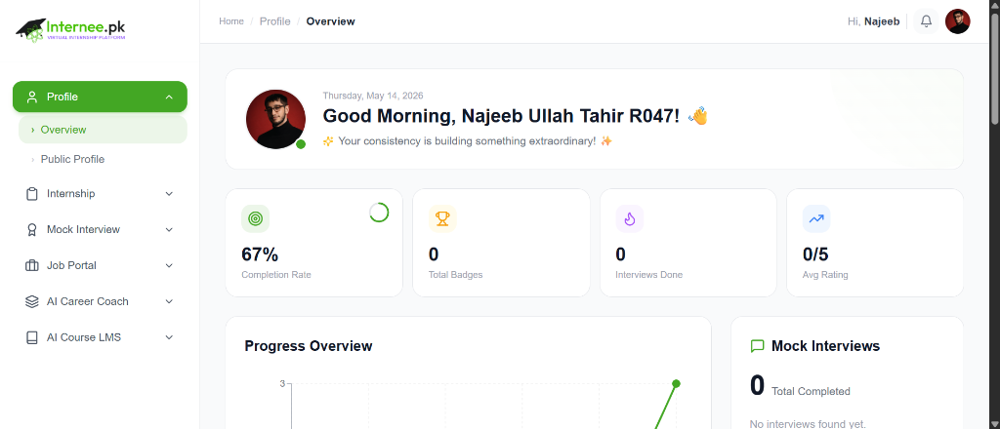
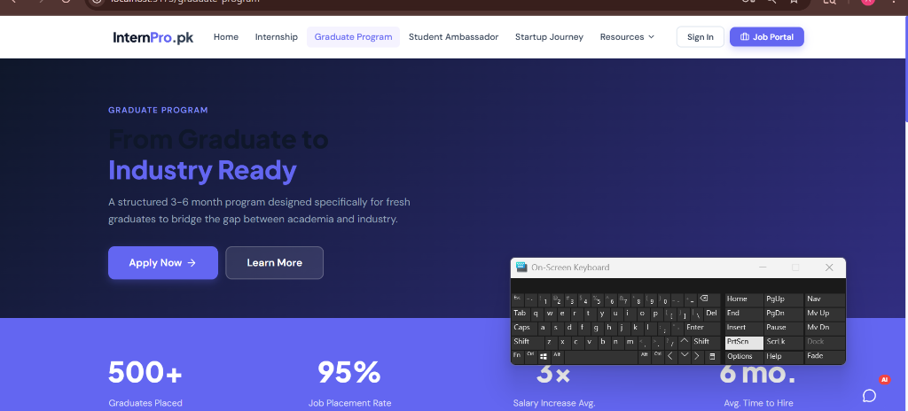

<div align="center">

# 🚀 InternPro.pk
### *Pakistan's #1 Virtual Internship Platform*

[](LICENSE)
[](https://nodejs.org/)
[](https://react.dev/)
[](https://expressjs.com/)
[](https://www.mongodb.com/)
[](https://vitejs.dev/)
[](http://makeapullrequest.com)

<br />

InternPro.pk is an end-to-end, full-stack virtual internship ecosystem designed to bridge the gap between academic education and modern industry demands. The platform empowers students with real-world project experience, AI-assisted mentorship, domain-tailored mock interviews, and seamless job discovery.

[View Features](#-key-features) • [Tech Stack](#%EF%B8%8F-tech-stack) • [Quick Start](#-getting-started) • [API Reference](#-api-endpoints) • [Contributing](#-contributing)

<br />


</div>

---

## 🌟 Key Features

### 🤖 1. InternPro AI Assistant (24/7 Smart Chatbot)
Interactive AI companion engineered to guide students throughout their internship lifecycle:
- **Intelligent Onboarding**: Automates track recommendations based on user skill profiles and career aspirations.
- **Task & Submission Support**: Clarifies weekly assignment objectives and submission criteria in real time.
- **AI Career Mentorship**: Provides contextual recommendations for resume refinement, skill roadmaps, and interview readiness.
- **Instant Resolution**: Answers platform FAQs regarding certifications, assessment deadlines, and guidelines.

<br />

<div align="center">
  
</div>

<br />

### 📊 2. Student & Track Dashboard
Centralized telemetry hub enabling users to monitor their learning journey:
- **Progress Tracking**: Real-time visual progress meters and milestone completion status.
- **Profile & Credential Management**: Dynamic profile configuration with persistent storage and bio updates.
- **Activity & Submission Log**: Immutable history of submitted tasks, evaluation scores, and feedback logs.

<br />

<div align="center">
  
</div>

<br />

### 💼 3. Internship & Job Opportunities Portal
- **Domain Specializations**: 50+ curated tracks spanning Web Development, Artificial Intelligence, Data Science, UI/UX, and Cloud Engineering.
- **1-Click Application Workflow**: Streamlined application pipeline for fast track enrollment.
- **Search & Advanced Filtering**: Filter opportunities by domain, tech stack requirements, and tenure.

<br />

<div align="center">
  
</div>

<br />

### 🎙️ 4. AI-Powered Mock Interview Module
- **Domain-Tailored Questions**: Dynamic prompt generation based on targeted role requirements.
- **Instant Performance Analytics**: Comprehensive scoring breakdowns with feedback for answer optimization.

---

## 🛠️ Tech Stack

| Layer | Technologies & Frameworks | Description |
| :--- | :--- | :--- |
| **Frontend UI** | **React 19**, **Vite 8** | High-performance single page application setup with HMR |
| **Styling & UX** | **Vanilla CSS3**, **Lucide React** | Custom responsive Glassmorphism design system & icon kit |
| **HTTP Client** | **Axios 1.16** | Centralized API communication layer with JWT bearer interceptors |
| **Client Routing**| **React Router DOM 7** | Declarative client-side routing & protected route wrappers |
| **Backend API** | **Node.js**, **Express 5** | Scalable REST API micro-architecture |
| **Database** | **MongoDB**, **Mongoose 9** | NoSQL data modeling with strict schema validations |
| **Security** | **JWT**, **Bcryptjs**, **Helmet**, **Rate-Limit** | Secure token handling, hash salts, HTTP headers, & DDoS protection |

---

## 📂 Repository Structure

```text
Intern_Pro/
├── assets/                  # High-resolution screenshots and platform preview assets
│   ├── home.png
│   ├── chatbot.png
│   ├── dashboard.png
│   └── internship-portal.png
├── backend/                 # Node.js & Express API Server
│   ├── config/              # Database connection & server environment setups
│   ├── controllers/         # Business logic handlers for routes
│   ├── middleware/          # JWT auth verification, rate limiters, & security checks
│   ├── models/              # Mongoose data schemas (Users, Internships, Submissions)
│   ├── routes/              # Express API endpoint definitions
│   ├── server.js            # Main Express application entry point
│   ├── .env.example         # Template for environment configuration
│   └── package.json
└── frontend/                # React 19 + Vite Frontend Application
    ├── src/
    │   ├── components/      # Reusable UI elements (Navbar, Cards, Modals, Chatbot)
    │   ├── pages/           # Route pages (Home, Dashboard, Internships, Interview)
    │   ├── styles/          # Custom CSS stylesheets & design tokens
    │   ├── App.jsx          # Main application component & routes
    │   └── main.jsx         # React DOM root entry point
    ├── index.html
    └── package.json
```

---

## 🚀 Getting Started

### Prerequisites
Make sure you have the following installed on your machine:
- **Node.js** `v18.0.0` or higher
- **MongoDB** (Local instance or [MongoDB Atlas](https://www.mongodb.com/cloud/atlas))
- **npm** `v9.0.0+` or **yarn**

### 1. Clone the Repository
```bash
git clone https://github.com/Najeeb1106/Intern_Pro.git
cd Intern_Pro
```

### 2. Configure & Run Backend Server
```bash
cd backend
npm install

# Copy environment variable template
cp .env.example .env

# Edit .env and supply your MongoDB connection string and JWT secret
npm run dev
```
> Server will start on `http://localhost:5000`

### 3. Configure & Run Frontend Application
Open a new terminal window in the root directory:
```bash
cd frontend
npm install
npm run dev
```
> Application will be accessible at `http://localhost:5173`

---

## 🔐 Environment Variables

The backend relies on environment variables defined in `backend/.env`. Refer to `backend/.env.example` for standard values:

| Variable | Requirement | Description | Default / Example |
| :--- | :--- | :--- | :--- |
| `PORT` | Optional | Port number for Express server | `5000` |
| `MONGO_URI` | **Required** | MongoDB connection URI string | `mongodb://localhost:27017/internpro` |
| `JWT_SECRET` | **Required** | Secret key used for signing JWT auth tokens | `your_super_secret_key_here` |
| `NODE_ENV` | Optional | Execution environment mode (`development` / `production`) | `development` |

---

## 📡 API Endpoints Overview

| Method | Endpoint | Access | Description |
| :--- | :--- | :--- | :--- |
| `POST` | `/api/auth/register` | Public | Register new internee profile |
| `POST` | `/api/auth/login` | Public | Authenticate user & return JWT token |
| `GET` | `/api/internships` | Public | Fetch available internship tracks with filters |
| `GET` | `/api/dashboard` | Protected | Retrieve internee dashboard progress & stats |
| `POST` | `/api/chat` | Protected | Interact with the InternPro AI Assistant |

---

## 🛡️ Security & Best Practices

- **Strict Authentication**: Secure JSON Web Token (JWT) workflow with server-side signature verification.
- **Password Protection**: Salting and hashing powered by `bcryptjs`.
- **HTTP Hardening**: Powered by `helmet` middleware to set protective HTTP headers against XSS and clickjacking.
- **Traffic Throttling**: Implemented `express-rate-limit` to protect API endpoints against DDoS and brute-force attempts.

---

## 🤝 Contributing

Contributions are welcome! Please follow these steps to contribute:

1. **Fork** the repository.
2. Create your Feature Branch (`git checkout -b feature/AmazingFeature`).
3. Commit your changes following [Conventional Commits](https://www.conventionalcommits.org/) (`git commit -m 'feat: add amazing feature'`).
4. Push to the Branch (`git checkout origin feature/AmazingFeature`).
5. Open a **Pull Request**.

---

## 📝 License

Distributed under the **MIT License**. See `LICENSE` for more information.

---

<div align="center">

Crafted with ❤️ by [**Najeeb**](https://github.com/Najeeb1106)

*Connecting ambitious talents with opportunity.*

</div>

